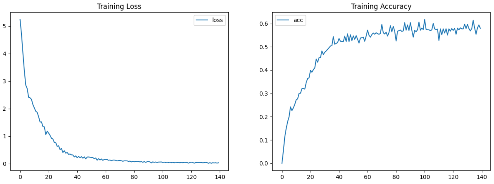

# Transformer Encoder-Decoder from Scratch

This repository contains a full from-scratch implementation of the Transformer architecture using only basic Python libraries and PyTorch. The goal is to build a clear and educational version of the model used in NLP tasks like machine translation.

### 🥰 Key Components Implemented:
- **Scaled Dot-Product Attention**  
  Computes attention scores between queries, keys, and values.
  
- **Multi-Head Attention**  
  Applies multiple attention heads in parallel to capture different relationships.

- **Positional Encoding**  
  Injects information about token positions to retain sequence order.

- **Encoder Layer**  
  A stack of self-attention and feedforward layers for encoding the input.

- **Decoder Layer**  
  Includes masked self-attention and encoder-decoder attention layers.

- **Transformer Model**  
  Combines encoder and decoder with shared embedding layers.

- **Learning Rate Scheduler**  
  Uses the warm-up and decay strategy described in the original Transformer paper.

- **Loss Function**  
  Cross-entropy loss with optional label smoothing.

- **Evaluation with BLEU Score**  
  Measures the quality of the generated translations.

---

### 📊 Visualizations

#### Training Progress
Here you can add images of your training progress, like loss curves or attention maps.

#### Transformer Architecture
Below is a visualization of the complete Transformer model, showing the encoder-decoder structure.

